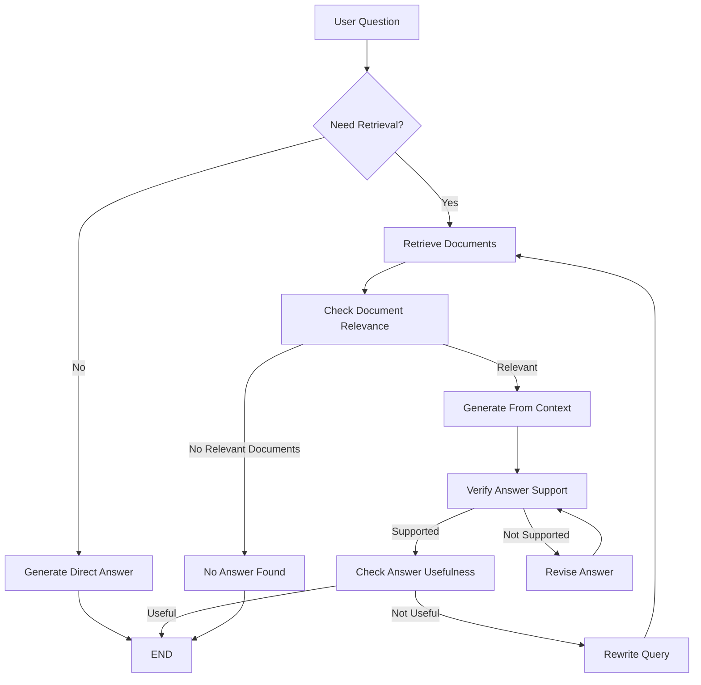
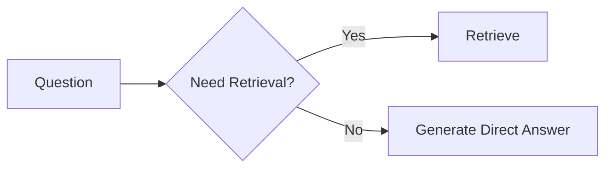
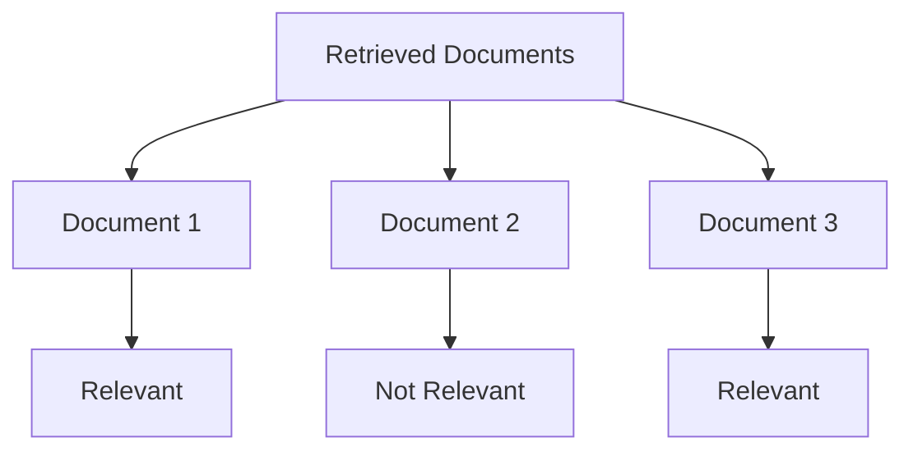
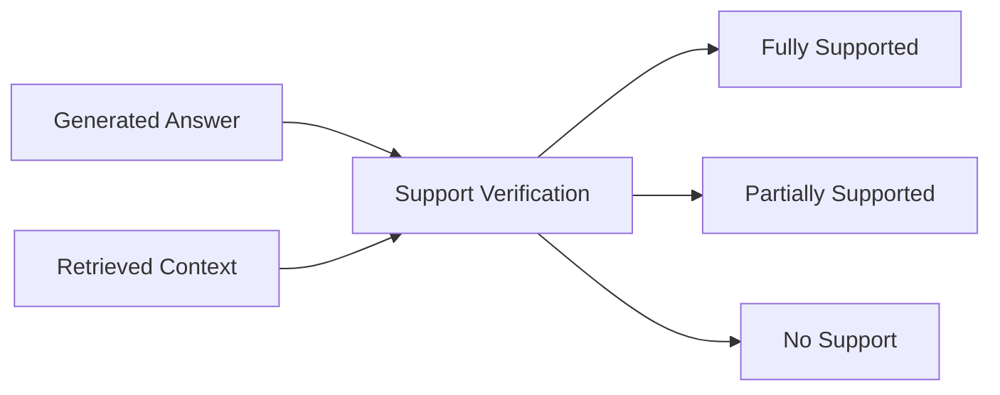
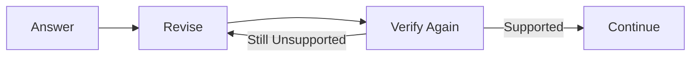
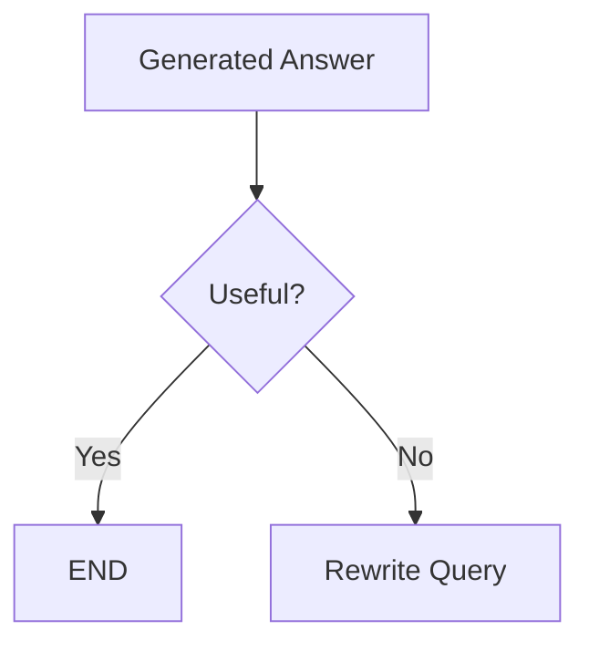
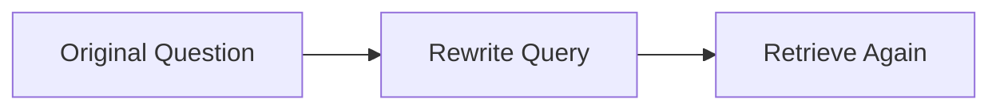
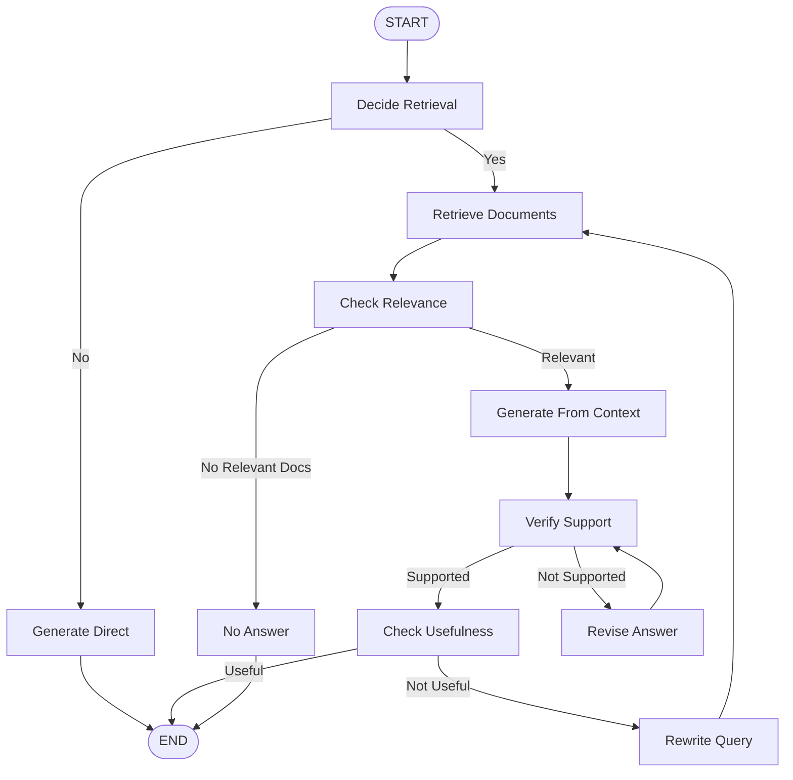

# Self-RAG using LangGraph + NVIDIA AI + FAISS

A Self-Reflective Retrieval-Augmented Generation (Self-RAG) implementation built with **LangGraph**, **LangChain**, **NVIDIA LLM**, **NVIDIA Embeddings**, and **FAISS**.

The workflow intelligently decides whether retrieval is necessary, verifies retrieved documents, validates generated answers, and automatically retries with an improved retrieval query when needed.

---

# Features

* Intelligent retrieval decision
* FAISS vector database
* NVIDIA Embeddings
* Document relevance filtering
* Context-only answer generation
* Answer grounding verification
* Query rewriting
* Automatic retry mechanism
* LangGraph workflow

---

# Tech Stack

| Component         | Library                        |
| ----------------- | ------------------------------ |
| LLM               | NVIDIA Chat                    |
| Workflow          | LangGraph                      |
| Embeddings        | NVIDIA Embeddings              |
| Vector Store      | FAISS                          |
| PDF Loader        | PyPDFLoader                    |
| Chunking          | RecursiveCharacterTextSplitter |
| Structured Output | Pydantic                       |

---

# Workflow Overview



---

# Step 1 - Document Preprocessing

Before answering any question, the documents are prepared for semantic search.

## Pipeline

```text
PDF Files
     │
     ▼
Load Documents
     │
     ▼
Split into Chunks
     │
     ▼
Generate Embeddings
     │
     ▼
Store in FAISS
     │
     ▼
Retriever
```

### Process

1. Load multiple PDF documents.
2. Split documents into small overlapping chunks.
3. Generate embeddings for every chunk.
4. Store embeddings inside FAISS.
5. Create a retriever using MMR search.

---

# Step 2 - Decide Whether Retrieval is Needed

Instead of always searching the vector database, the model first decides whether retrieval is required.

Examples

| Question                            | Retrieval |
| ----------------------------------- | --------- |
| What is Python?                     | ❌ No      |
| What is our company's leave policy? | ✅ Yes     |

---



---

# Step 3 - Direct Generation

If retrieval is unnecessary, the LLM answers using its general knowledge.

```text
Question
    │
    ▼
LLM
    │
    ▼
Answer
```

---

# Step 4 - Retrieve Documents

The retriever searches the FAISS vector database.

```text
Question
     │
     ▼
Retriever
     │
     ▼
Top 3 Similar Documents
```

---

# Step 5 - Document Relevance Check

Each retrieved document is checked independently.

Only relevant documents continue to the next stage.



After filtering:

```text
Relevant Documents
        │
        ▼
Merged Context
```

---

# Step 6 - Generate Answer From Context

The filtered documents are combined into one context.

```text
Relevant Documents
        │
        ▼
Context
        │
        ▼
LLM
        │
        ▼
Answer
```

The prompt instructs the model to:

* Use only the provided context
* Never use outside knowledge
* Return "No relevant document found" if context is insufficient

---

# Step 7 - Verify Answer Support

The generated answer is compared against the retrieved context.

Possible outputs:

* Fully Supported
* Partially Supported
* No Support



---

# Step 8 - Revise Unsupported Answers

If the answer is not sufficiently supported, it is regenerated.



This loop continues until:

* Answer is supported
* Maximum retry count is reached

---

# Step 9 - Check Answer Usefulness

A grounded answer is not always useful.

Example

Question

> What is the refund policy?

Poor Answer

> Our company values customers.

Although it may be true, it does not answer the question.



---

# Step 10 - Rewrite Query

If the answer is not useful, the original question is rewritten into a better retrieval query.

Example

Original

```text
Can I get my money back?
```

Rewritten

```text
refund policy cancellation refund timeline
```

The improved query is sent back to the retriever.



---

# Complete LangGraph Pipeline



---

# Retry Strategy

## Answer Revision Loop

```text
Generate Answer
      │
      ▼
Verify Support
      │
      ▼
Revise Answer
      │
      └───────────────► Verify Again
```

---

## Query Rewrite Loop

```text
Question
    │
    ▼
Retrieve
    │
    ▼
Generate
    │
    ▼
Useful?
    │
    ▼
Rewrite Query
    │
    └────────────► Retrieve Again
```

---

# Project Structure

```text
Self_RAG_Module.py

│
├── Document Preprocessing
├── State Definition
├── Retrieval Decision
├── Direct Generation
├── Retrieve Documents
├── Relevance Checking
├── Context Generation
├── Support Verification
├── Answer Revision
├── Useful Check
├── Query Rewriting
└── LangGraph Workflow
```

---

# Advantages

* Reduces unnecessary retrieval
* Improves retrieval quality
* Filters irrelevant documents
* Minimizes hallucinations
* Verifies answer grounding
* Automatically retries when answers are poor
* Modular LangGraph architecture

---

# Future Improvements

* Hybrid Search (BM25 + Dense Retrieval)
* Cross Encoder Re-ranking
* Parent Document Retriever
* Multi Query Retrieval
* Context Compression
* Streaming Responses
* Human-in-the-Loop
* Memory Integration
* Citation Generation
* Web Search Fallback

---

# Overall Lifecycle

```text
User Question
      │
      ▼
Need Retrieval?
      │
 ┌────┴────┐
 │         │
 ▼         ▼
Direct   Retrieve
           │
           ▼
Relevance Check
           │
           ▼
Generate Answer
           │
           ▼
Support Verification
           │
           ▼
Useful Check
           │
      ┌────┴────┐
      │         │
      ▼         ▼
     END   Rewrite Query
                │
                ▼
           Retrieve Again
```

---

**This implementation demonstrates a complete Self-RAG pipeline where the system not only retrieves and generates answers, but also evaluates its own outputs, revises unsupported responses, and improves retrieval through query rewriting for higher reliability.**
