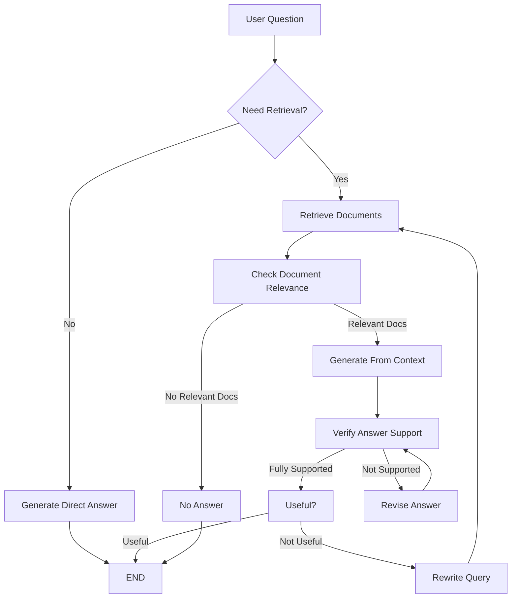
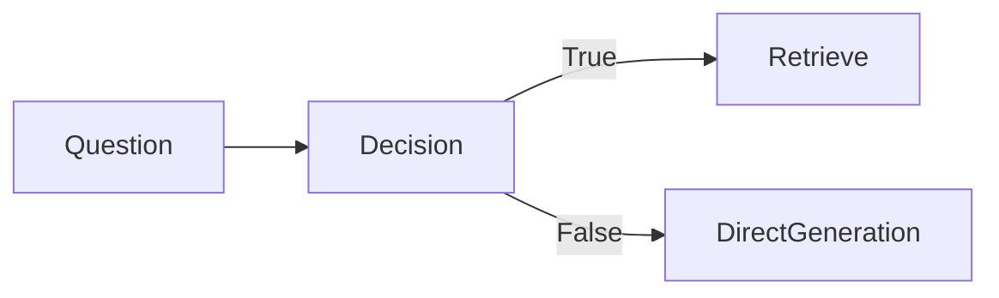
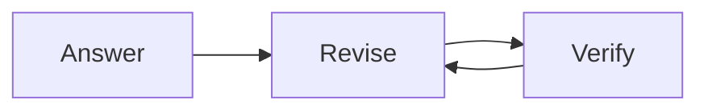
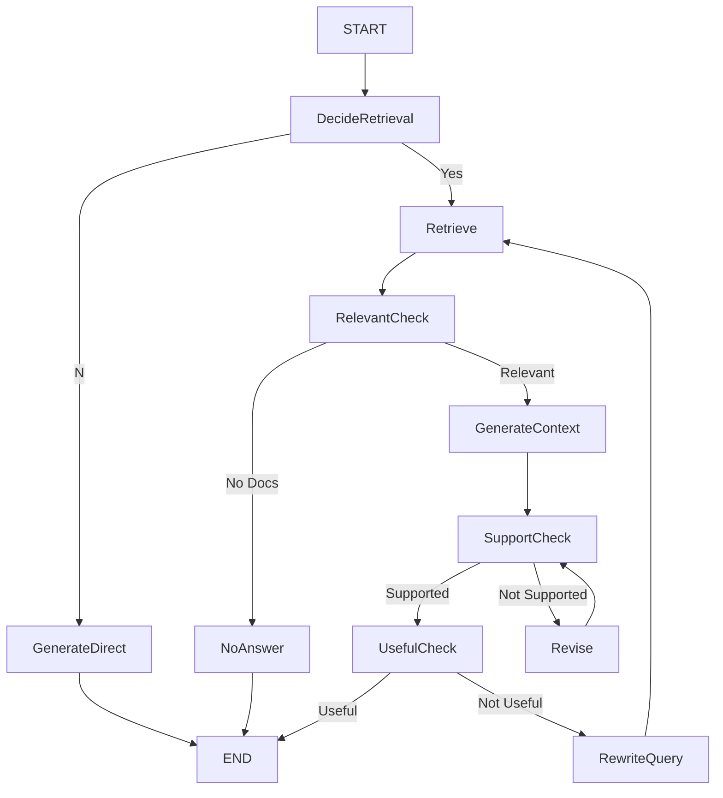

# Self-RAG using LangGraph + NVIDIA AI + FAISS

A complete implementation of **Self-RAG (Self Reflective Retrieval Augmented Generation)** using:

- LangGraph
- LangChain
- NVIDIA LLM
- NVIDIA Embeddings
- FAISS Vector Database
- Structured Output (Pydantic)

---

# What is Self-RAG?

Unlike traditional RAG, Self-RAG continuously evaluates its own answers.

Instead of simply retrieving documents and generating an answer, it asks itself:

- Do I even need retrieval?
- Are the retrieved documents relevant?
- Is my answer actually supported by those documents?
- Is my answer useful?
- If not...
    - Rewrite the query
    - Retrieve again
    - Generate again

This feedback loop greatly improves answer quality.

---

# Overall Workflow



---

# Project Pipeline

The system consists of **11 nodes**.

```
Question
    │
    ▼
Decide Retrieval
    │
    ├──────────────► Direct Generation
    │
    ▼
Retrieve
    │
    ▼
Check Relevance
    │
    ▼
Generate From Context
    │
    ▼
Support Verification
    │
    ▼
Useful Check
    │
    ▼
Rewrite Query
```

---

# Step 1 : Document Preprocessing

## Purpose

Prepare documents for semantic search.

### Process

```
PDF Files
      │
      ▼
Load PDFs
      │
      ▼
Split into Chunks
      │
      ▼
Generate Embeddings
      │
      ▼
Store inside FAISS
      │
      ▼
Retriever
```

### Code Flow

```
PDF
 ↓
PyPDFLoader

 ↓
RecursiveCharacterTextSplitter

 ↓
NVIDIA Embedding

 ↓
FAISS

 ↓
Retriever
```

---

# Step 2 : Decide Whether Retrieval is Needed

Node:

```
decide_retrieval()
```

Instead of always searching documents, the LLM first decides whether retrieval is necessary.

Examples

Question:

```
What is Python?
```

No retrieval required.

Question:

```
What is my company's leave policy?
```

Retrieval required.

Decision Output

```
{
    "should_retrieve": true
}
```

---

Diagram



---

# Step 3 : Direct Generation

If retrieval is not required:

```
Question

↓

LLM

↓

Answer
```

No document search occurs.

---

# Step 4 : Retrieve Documents

Node

```
retrieve()
```

Uses

- FAISS
- NVIDIA Embeddings
- MMR Search

Process

```
Question

↓

Retriever

↓

Top 3 Documents
```

---

# Step 5 : Relevance Checking

Not every retrieved document is useful.

Each document is evaluated individually.

```
Question

+

Document

↓

LLM

↓

Relevant ?

```

Example

Question

```
Leave Policy
```

Document

```
Company Leave Policy
```

Relevant

Question

```
Leave Policy
```

Document

```
Company Financial Report
```

Not Relevant

---

Diagram

```mermaid
flowchart TD

Retriever

-->

Doc1

-->

Relevant

Retriever

-->

Doc2

-->

Not Relevant

Retriever

-->

Doc3

-->

Relevant
```

Only relevant documents continue.

---

# Step 6 : Generate Answer From Context

Context is created by concatenating every relevant document.

```
Relevant Doc 1

+

Relevant Doc 2

+

Relevant Doc 3

↓

Large Context

↓

LLM

↓

Answer
```

The model is explicitly instructed:

- Use ONLY provided context
- Never use outside knowledge

---

# Step 7 : Support Verification (Self Reflection)

This is the most important part.

Node

```
is_sup()
```

The model asks itself

```
Is my answer actually supported by the context?
```

Output

```
Fully Supported

Partially Supported

No Support
```

Diagram

```mermaid
flowchart TD

Generated Answer

+

Context

↓

Support Checker

↓

Fully Supported

Partially Supported

No Support
```

---

# Step 8 : Revise Answer

If answer isn't supported

```
Answer

↓

Revision Prompt

↓

Quote Only

↓

Support Check Again
```

This loop continues until

- Fully supported

or

- Maximum retries reached

---

Diagram



---

# Step 9 : Useful Check

Even if an answer is correct...

It may still not answer the user's question.

Example

Question

```
What is refund policy?
```

Answer

```
Our company values customers...
```

Supported?

Yes.

Useful?

No.

The model therefore performs another evaluation.

Output

```
Useful

or

Not Useful
```

---

Diagram

```mermaid
flowchart TD

Answer

↓

Useful?

↓

Yes -------> END

No

↓

Rewrite Query
```

---

# Step 10 : Rewrite Query

When the answer isn't useful, the original question is rewritten into a better retrieval query.

Example

Original

```
Can I get my money back?
```

Rewritten

```
Refund policy cancellation refund timeline
```

The improved query retrieves better documents.

---

Diagram

```mermaid
flowchart TD

Question

↓

Rewrite Query

↓

Retrieve Again

↓

Generate Again
```

---

# Complete LangGraph



---

# Retry Mechanism

Two retry loops exist.

## Loop 1

Support Verification

```
Generate

↓

Verify

↓

Revise

↓

Verify

↓

Revise
```

Stops after

```
MAX_RETRIES
```

---

## Loop 2

Query Improvement

```
Question

↓

Retrieve

↓

Generate

↓

Useful?

↓

Rewrite

↓

Retrieve Again
```

Stops after

```
MAXIMUM_TRIES
```

---

# Technologies Used

| Component | Library |
|------------|----------|
| Workflow | LangGraph |
| LLM | NVIDIA Chat |
| Embedding | NVIDIA Embedding |
| Vector Store | FAISS |
| Structured Output | Pydantic |
| Prompting | LangChain |
| Loader | PyPDFLoader |

---

# Advantages of Self-RAG

- Retrieves documents only when needed.
- Filters irrelevant documents.
- Prevents hallucinations.
- Verifies factual grounding.
- Improves retrieval through query rewriting.
- Produces more reliable answers than standard RAG.
- Modular LangGraph workflow with clear decision points.

---

# Future Improvements

- Hybrid Search (BM25 + Dense Retrieval)
- Cross-Encoder Re-ranking
- Multi-Query Retrieval
- Context Compression
- Citation Generation
- Streaming Responses
- Human-in-the-Loop Review
- Memory Integration
- Agentic Tool Calling
- Adaptive Retrieval Strategies

---

# Workflow Summary

```
User Question
      │
      ▼
Need Retrieval?
      │
 ┌────┴────┐
 │         │
 ▼         ▼
Direct   Retrieve
           │
           ▼
     Relevance Check
           │
           ▼
 Generate from Context
           │
           ▼
 Verify Support
           │
           ▼
 Useful Check
           │
      ┌────┴────┐
      │         │
      ▼         ▼
     END   Rewrite Query
                │
                ▼
            Retrieve Again
```

---

# Self-RAG Lifecycle

```
Question
   ↓
Need Retrieval
   ↓
Retrieve
   ↓
Filter Documents
   ↓
Generate
   ↓
Verify
   ↓
Useful?
   ↓
Rewrite
   ↓
Retrieve Again
   ↓
END
```
